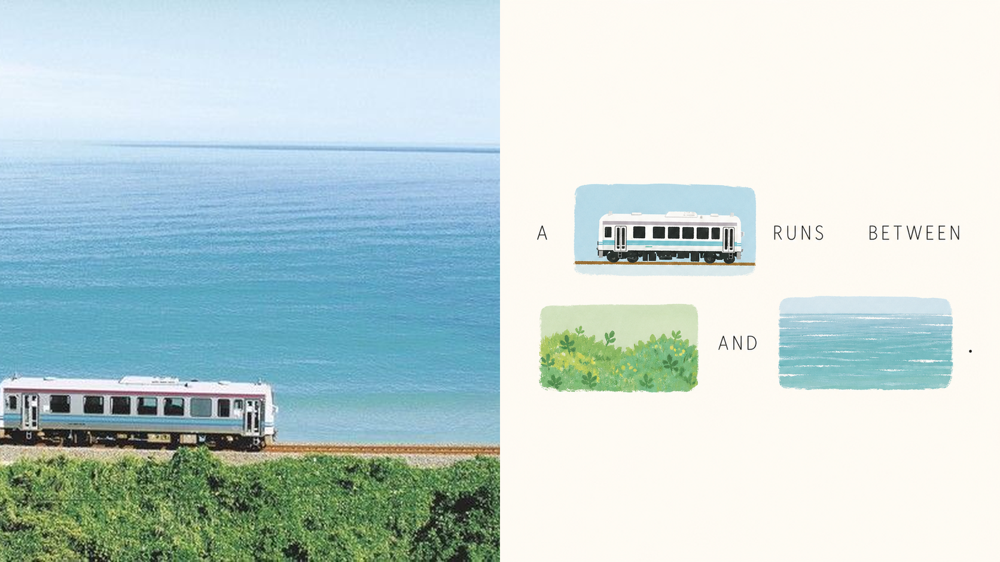
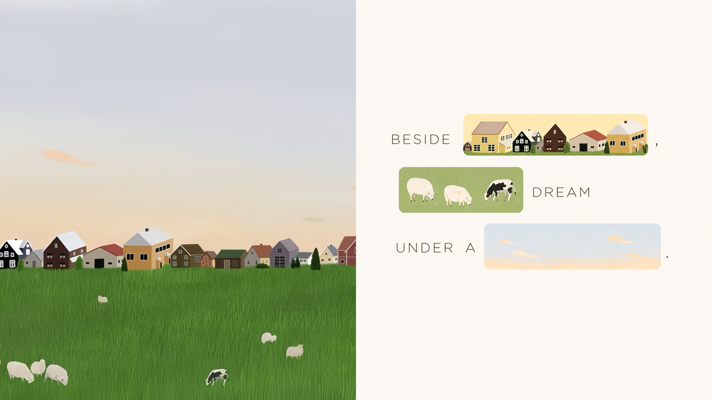
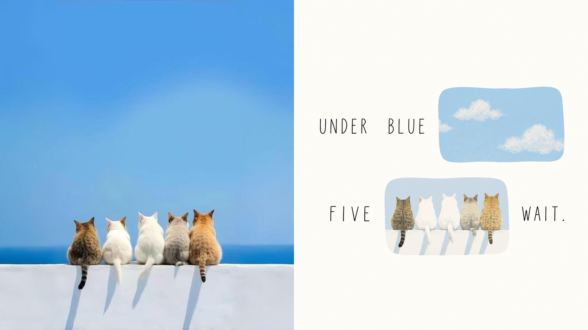
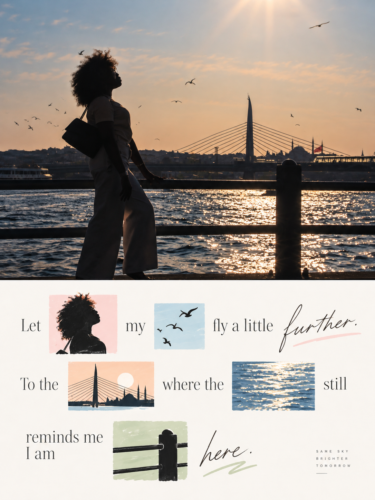
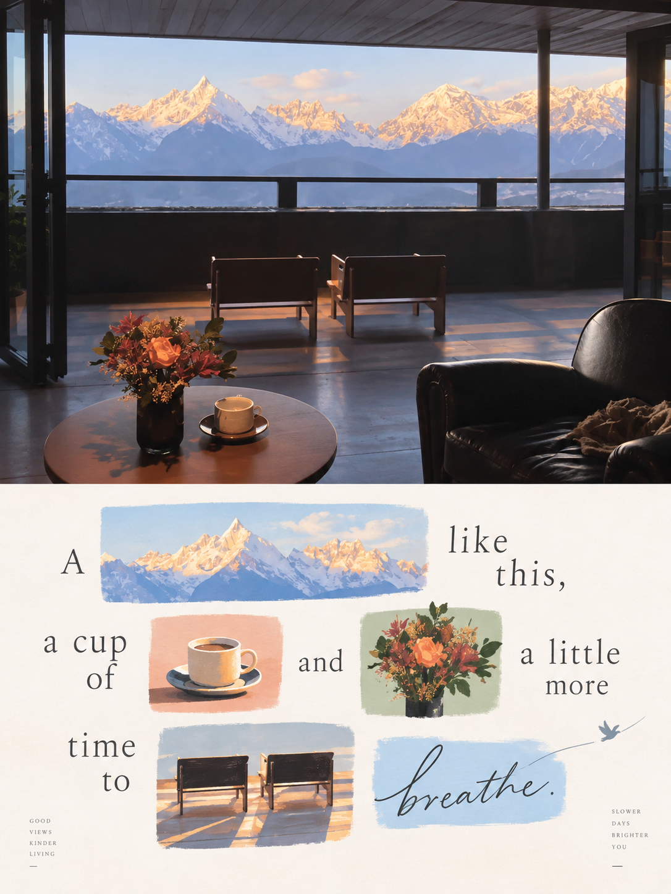

<div align="center">

# 🦁 XXD Panel 107｜이미지 낱말 시

### 사진 속 꽃, 창문, 길과 바람을 실제로 읽을 수 있는 한 줄의 시로 만듭니다


<a href="README.md">简体中文</a> · <a href="README.en.md">English</a> · <a href="README.ja.md">日本語</a> · <strong>한국어</strong> · <a href="README.ar.md">العربية</a>

</div>

## 예시 작품

**16:9 가로형 좌우 예시**

| sample-05 | sample-06 |
|---|---|
|  |  |
|  |  |

**3:4 세로형 상하 예시**

| sample-09 | sample-10 |
|---|---|
|  |  |
|  |  |

위 여덟 작품은 16:9 가로형 좌우 구성 네 장과 3:4 세로형 상하 구성 네 장입니다. 모두 Panel 107가 자체 원본 프롬프트에 따라 독립적으로 생성했으며 다른 번호의 작품을 재사용하지 않았습니다. 예시 문구는 영어로 자동 생성했습니다.

<!-- xxd-human-intro:start -->
## 어울리는 상황과 해결하는 문제

사진의 감정은 한 줄의 문구만으로 다 말하기 어렵고 장식용 작은 그림에 묻혀서도 안 됩니다. **Panel 107**는 한쪽에 사진을 남기고 다른 쪽을 실제로 읽을 수 있는 시각 문장으로 만듭니다. 문장 속 꽃, 창문, 길이나 동작이라는 낱말은 사진에서 온 손그림 이미지로 직접 대체됩니다. 문자나 이미지 중 하나라도 빠지면 문장이 완성되지 않습니다.

### 이런 경우에 잘 맞습니다

- **한 문장만으로 사진의 느낌을 담기 어려울 때:** 원본의 피사체, 동작, 심상이 빠진 단어의 역할을 직접 맡습니다.
- **‘완전한 제목＋옆에 작은 그림 몇 개’를 원하지 않을 때:** 이미지 낱말이 실제 단어 자리에 들어가 문자와 이미지를 함께 읽어야 합니다.
- **유치하지 않으면서 가볍고 산뜻한 이미지-텍스트 디자인이 필요할 때:** 밝고 부드러운 색면, 현대적 손그림 편집 일러스트, 넓은 여백을 사용합니다.
- **하나의 스타일로 유연하게 납품해야 할 때:** 상하, 좌우, 디자인 전용, 여러 비율, 네 기기 배경화면, 이미지 폴더 일괄 처리를 지원합니다.

### 해결해 주는 것

- ‘문구 옆의 그림’을 ‘그림 자체가 낱말’인 구조로 바꿔 문자와 이미지가 따로 노는 문제를 해결합니다.
- 사진의 감정, 동작, 관계, 장소, 기억에서 짧은 문장을 만들고 시각화하기 좋은 낱말을 자동으로 고릅니다.
- 명확한 읽기 경로로 스티커 벽, 카드 그리드, 어수선한 콜라주를 피합니다.

### 빠른 시작

> 이 이미지를 XXD Panel 107로 처리하고 가장 알맞은 구도와 크기를 먼저 추천해 주세요.

<!-- xxd-human-intro:end -->

<!-- xxd-panel-benefit:start -->
## 빠른 적합성 확인

| 궁금한 점 | 이 스타일이 제공하는 것 |
|---|---|
| **결과물** | 사진과 이미지 낱말 시가 정확히 반씩 나뉘고 문자＋이미지 낱말로만 전체 문장을 읽을 수 있는 포스터 |
| **대표 특징** | 문자 조각과 손그림 이미지 낱말이 한 읽기 경로에서 번갈아 나타나며 이미지는 옆 장식이 아니라 밝은 색면 안에 있습니다 |
| **원본을 존중하는 방식** | 현실 영역은 정체성, 구조, 자세, 빛과 색을 보존하고 각 이미지 낱말은 같은 사진의 기억점에서 직접 뽑습니다 |
| **활용처** | 예술 포스터, 독립 출판 표지, 전시 이미지, 소셜 콘텐츠, 디자인 전용 작품, 네 기기 배경화면 |
<!-- xxd-panel-benefit:end -->

## 사용 팁

- **선명한 사진 한 장부터 시작하세요:** 피사체, 동작, 관계가 잘 보이는 이미지를 고른 뒤 출력 방식과 비율을 정합니다.
- **파라미터를 한 문장으로 연결하세요:** “상하 / 좌우 / 순수 디자인 + 16:9 / 3:4 / 휴대폰 배경화면”처럼 말하고 컴퓨터·태블릿·스마트워치 크기도 덧붙일 수 있습니다.
- **남겨야 할 것을 분명히 하세요:** 인물, 사물, 동작, 관계, 문구를 지정하되 레이아웃을 지나치게 고정하지 않아야 스타일이 자연스럽게 설계합니다.
- **텍스트 방식을 고르세요:** 이미지에서 지능적으로 생성하게 하거나, `--text exact --copy`로 정확한 문구를 고정하거나, `--text none`으로 글자를 없앨 수 있습니다.
- **사진 영역과 디자인 영역을 설명하세요:** 상하·좌우에서는 사진을 남길 쪽과 다시 디자인할 쪽을 말하고, 순수 디자인·배경화면은 전체 캔버스를 다시 설계한다고 알려 주세요.
- **한 장을 먼저 시험한 뒤 일괄 처리하세요:** 모드, 비율, 텍스트, 언어를 한 장에서 확인하고 같은 설정을 폴더에 적용합니다. 비교를 위해 한 번에 한 변수만 바꾸세요.

## 시작하기

```bash
git clone https://github.com/nevertoday/xxd-panel-107.git
mkdir -p ~/.codex/skills
ln -s "$(pwd)/xxd-panel-107" ~/.codex/skills/xxd-panel-107
```

`npx skills`로도 바로 설치할 수 있습니다:

```bash
npx skills add https://github.com/nevertoday/xxd-panel-107 --skill xxd-panel-107
```

이 명령은 GitHub에서 저장소를 가져와 같은 이름의 Skill을 현재 Agent에 설치합니다. 사용자 전역 Codex Skills 디렉터리에 설치하려면 명령 끝에 `--global --agent codex --yes`를 추가하세요.

Claude Code 사용자는 같은 폴더를 다음 위치에 연결할 수 있습니다: `~/.claude/skills/xxd-panel-107`. 설치 후 에이전트 세션을 다시 시작하세요.

```text
$xxd-panel-107
Use this photograph, ask me for the modes and copy setting, then generate fresh raster outputs.
```

전체 사양: [Skill 워크플로](SKILL.md) · [원본 스타일 자료](references/original-prompt/zh-CN.md) · [영문 런타임 어댑터](references/xxd-panel-107-prompt.en.md) · [중문 런타임 어댑터](references/xxd-panel-107-prompt.zh-CN.md)

## 원본 프롬프트 · 다섯 언어

[简体中文](references/original-prompt/zh-CN.md) · [English](references/original-prompt/en.md) · [日本語](references/original-prompt/ja.md) · [한국어](references/original-prompt/ko.md) · [العربية](references/original-prompt/ar.md)

중국어 파일은 사용자가 제공한 원문을 그대로 보존하며 실행 시 유일한 창작·미학 기준입니다. 다른 네 언어는 완전하고 충실한 열람용 번역이며 생성 프롬프트를 다시 쓰지 않습니다.

**특징:** 실제 이미지 낱말 치환 · 읽을 수 있는 리버스 문장 · 현대 손그림 편집 일러스트 · 밝고 부드러운 색면 · 2–4줄 읽기 경로 · 넓은 여백 · 엄격한 50:50 이중 영역


## 완성작에서 알아보기 쉬운 특징

- 상하는 3:4가 기본이지만 사용자가 고른 다른 전체 캔버스 크기에서도 항상 정확히 50:50이며, 좌우도 정확히 50:50으로 나눠 세 번째 하단 띠나 제목 띠를 만들지 않습니다.
- 변환 영역은 완전한 문장 의미에서 여러 낱말을 삭제한 뒤 그 자리에 이미지를 되돌려 놓습니다. 대체된 낱말은 문자로 다시 표시하지 않습니다.
- 모든 이미지 낱말은 현재 사진에서 오지만 단순 윤곽, 평면색, 가벼운 손맛의 현대 편집 일러스트로 통일해 다시 그리며 사진 조각을 쓰지 않습니다.
- 색면은 정사각형, 가로로 좁은 모양, 세로로 긴 모양, 불규칙형이 될 수 있고 의미의 무게에 따라 달라져도 한 기준선과 읽기 경로 안에 남아 카드 벽이 되지 않습니다.
- 2–4줄의 문자, 이미지 낱말, 여백, 미세한 어긋남이 명확한 리듬을 만들며 원본의 생명력 있는 색을 밝고 부드럽게 재조율합니다.

미적 제약은 [원본 프롬프트](references/original-prompt/zh-CN.md)에만 있습니다. Skill과 실행 어댑터는 납품 변수만 처리합니다. [Skill](SKILL.md) · [영문 실행 어댑터](references/xxd-panel-107-prompt.en.md)

<details>
<summary><strong>전체 기능과 매개변수 (필요할 때 펼치기)</strong></summary>

## 원본 프롬프트가 유일한 미적 기준입니다

`references/original-prompt/zh-CN.md`는 이 프로젝트의 유일한 창작·미적 기준입니다. Skill은 원문을 요약하거나 확장하지 않으며 공통 색상 계획, 미적 동기, 제목, 마이크로카피를 추가하지 않습니다. 색, 재료, 구성, 여백, 문구, 타이포그래피는 GPT Image 2가 원본 프롬프트의 규칙대로 수행합니다.

상하 모드는 원문의 3:4와 상하 50:50을 유지하고 좌우 모드는 같은 등분 원칙을 좌우 50:50으로 옮깁니다. 디자인 전용과 배경화면만 이중 영역 컨테이너를 대체하지만 이미지가 실제 낱말을 대신하는 읽기 문법은 바꾸지 않습니다.

## 조합 가능한 네 가지 출력

`top-bottom`, `left-right`, `design-only`, `wallpaper-pack`을 하나 이상 선택할 수 있습니다. 여러 모드를 고르면 각 모드를 독립 프롬프트로 따로 생성합니다.

- `top-bottom`: 기본 3:4 또는 명시된 다른 전체 캔버스를 정확히 같은 높이로 나눠 위 50%는 현실 사진, 아래 50%는 이미지 낱말 시입니다.
- `left-right`: 캔버스를 정확히 같은 폭으로 나눠 왼쪽 50%는 현실 사진, 오른쪽 50%는 이미지 낱말 시입니다. 두 영역 모두 위끝부터 아래끝까지 이어지고 세 번째 하단 띠가 없습니다.
- `design-only`: 원본은 보이지 않는 참조이며, 보이는 모든 요소가 해당 Panel의 디자인 변환 언어를 따릅니다.
- `wallpaper-pack`: 각 기기마다 디자인 변환만으로 된 전체 화면 배경을 독립적으로 재구성합니다.

모든 이중 영역 결과물은 정확한 50:50과 세 번째 띠가 없는지 검사합니다. 기본은 완성 캔버스 한 번 생성이며 정확한 중점이나 원본 픽셀 보존을 직출할 수 없을 때만 마지막 무손실 합성을 사용합니다. 합성 포스터를 다시 모델에 넣지 않습니다.

일반 크기도 복수 선택할 수 있습니다: 자동 맞춤, 원본 비율, 1:1, 3:4, 4:3, 4:5, 5:4, 2:3, 3:2, 9:16, 16:9, 21:9, 5:7, 7:5, 사용자 비율／정확한 픽셀. 암묵적 기본 크기는 없습니다. 서로 다른 비율은 동일한 원본 프롬프트에서 각각 다시 구성합니다.

배경화면 세트는 연속형 또는 독립형입니다. 연속형은 먼저 기준 이미지 한 장을 만들고, 나머지는 원본 사진＋기준 이미지를 함께 참고해 각 기기에 맞게 재구성합니다. 한 이미지를 네 크기로 기계적으로 자르지 않습니다.

호출마다 작업 디렉터리는 하나만 만들고 모든 최종 PNG를 그 안에 바로 저장합니다. 원본, 모드, 크기, 기기별 하위 폴더를 만들지 않으며 원본 순서와 정리된 원본 이름을 포함한 `source-001-street-left-right-3x2-2160x1440.png`, `source-001-street-wallpaper-linked-phone-1440x3200.png` 같은 파일명으로 구분합니다.

이미지 폴더를 직접 전달하면 이 병사 Skill이 같은 Panel 107의 원본 미학으로 일괄 처리합니다. 일반 래스터 형식을 기본적으로 재귀 탐색하고 수량을 먼저 알린 뒤 모드·크기·텍스트·언어를 한 번만 확인합니다. 각 이미지는 내용이나 문구가 섞이지 않도록 독립 생성하며 전체 배치는 하나의 평면 작업 디렉터리만 사용합니다. 개별 실패는 기록하고 이후 이미지를 조용히 누락하지 않습니다.

## 텍스트 모드

생성 전에 다음 중 하나를 정합니다.

1. **원본 프롬프트에 따라 모델이 텍스트 생성**: 완전한 문장 의미를 만든 뒤 시각화할 낱말을 삭제하고 이미지 낱말로 제자리 치환합니다. 대체된 낱말은 문자로 다시 쓰지 않습니다.
2. **내 정확한 문구 사용**: 사용자 문장을 정확한 바탕 문장으로 삼고 이미지 낱말로 선택한 말만 삭제합니다. 나머지 문자는 모두 그대로 유지합니다.
3. **텍스트 없음**: 모든 텍스트와 가짜 문자를 금지합니다. 이는 107의 이미지 낱말 시 정체성을 포기하는 예외이며 사용자가 명시적으로 받아들일 때만 사용합니다.

외부 Skill은 제목이나 마이크로카피를 미리 쓰지 않습니다. 출력 언어는 인터페이스 언어와 별도로 확인하며 인물, 장면, 파일명에서 추정하지 않습니다.

## 완성 캔버스 우선과 래스터 경계

이미지 모델이 완성 화면 전체의 미학적 재구성을 담당하며 이중 패널도 완성 캔버스 한 장의 직접 생성을 기본으로 합니다. `scripts/compose_panel.py`는 조건부 복구, 무손실 픽셀 조정, 읽기 전용 검수에만 사용하고 매번 사전 계획하거나 미학적 성공을 판단하지 않습니다.

모든 결과물은 PNG 래스터이며 호출마다 `~/Desktop/xxd/`에 새 작업을 만듭니다. 설정된 이미지 경로는 비식별 상태만 반환하며 제공자, 엔드포인트, 인증 정보, 헤더, 프롬프트, 응답, 계정 정보를 공개하지 않습니다. SVG, HTML, Canvas, 도표와 프로그램 그림은 최종 작품을 대신할 수 없습니다.

## 호스트 기능에 맞춘 질문과 인라인 매개변수

같은 Skill이 호스트가 실제로 제공하는 상호작용 기능에 맞춰 동작하며 장식 기호를 클릭 가능한 UI처럼 보이게 하지 않습니다.

- **Claude Code에 `AskUserQuestion + multiSelect: true`가 있으면**: 모드와 크기는 실제 체크박스, 텍스트 방식과 배경화면 관계는 단일 선택을 사용합니다. 일반 크기는 정사각형·세로·가로 그룹으로 나누고 선택을 누적하며 사용자 크기는 자유 입력합니다.
- **Codex에 `request_user_input`만 있으면**: 텍스트 방식과 배경화면 관계처럼 상호 배타적인 항목에만 사용합니다. 모드와 크기를 단일 선택처럼 꾸미지 않고 조합 입력으로 받습니다.
- **상호작용 도구가 없으면**: 첫 번째 질문에서 모드, 두 번째 질문에서 크기＋텍스트 방식을 입력합니다. 가짜 `- [ ]`를 표시하지 않고 폼만을 위해 Plan mode 전환을 요구하지 않습니다.

두 번째 질문은 처음에 스마트 추천／원본 비율／일반 비율／사용자 지정만 보여 줍니다. 일반 비율을 선택할 때만 정사각형 `1:1`, 세로 `3:4, 4:5, 2:3, 9:16, 5:7`, 가로 `4:3, 5:4, 3:2, 16:9, 21:9, 7:5`를 펼칩니다. 여러 비율과 정확한 픽셀을 함께 지정할 수 있습니다.

모든 설정은 인라인으로도 전달할 수 있습니다.

```text
/xxd-panel-107 photo.jpg --mode top-bottom,design-only --size auto,3:4,9:16 --text prompt --locale ja-JP
```

`--mode`, 반복 가능한 `--size`, `--text prompt|exact|none`, `--locale`, `--copy`, `--wallpaper linked|independent`, `--wallpaper-size`, `--out`, `--prefs`를 지원합니다. 값이 모두 있으면 질문을 건너뛰고, 일부만 있으면 누락된 항목만 묻습니다.

### 지난 설정을 이어 쓰거나 새로 설정하기

유효한 기록이 있고 이번 전달 설정이 아직 완성되지 않았으면, Skill이 지난 모드, 크기, 텍스트와 언어, 배경화면 관계, 출력 위치를 요약한 뒤 **그대로 사용**, **불러온 뒤 수정**, **새로 설정**의 세 가지 상호 배타적 선택지를 제공합니다. 이번 호출에서 명시한 요구가 항상 우선하며, 필요한 매개변수가 모두 있으면 불필요한 질문을 하지 않습니다.

`--prefs last|edit|new|off|clear`로 동작을 바로 지정할 수 있습니다.

```text
/xxd-panel-107 photo.jpg --prefs last
/xxd-panel-107 photo.jpg --prefs edit
/xxd-panel-107 photo.jpg --prefs new
```

기록에는 전달 설정만 저장합니다. 원본 이미지, 정확한 문구, 생성 결과, Panel 선택, 모델 경로, API 자격 증명이나 기타 민감한 정보는 저장하지 않습니다.

`photo.jpg` 대신 이미지 폴더 경로를 전달하면 별도의 `--batch` 옵션 없이 자동으로 일괄 처리합니다.

### 매개변수 빠른 참조

| 매개변수 | 용도 | 일반 값·형식 |
|---|---|---|
| `--mode` | 하나 이상의 결과물 유형 선택 | `top-bottom`, `left-right`, `design-only`, `wallpaper-pack` |
| `--size` | 일반 모드의 비율·정확한 픽셀을 여러 개 지정 | `auto`, `source`, `3:4`, `9:16`, `2160x3840` |
| `--text` | 화면 글자의 생성 방식 | `prompt`, `exact`, `none` |
| `--locale` | 화면 글자의 언어·지역 | `zh-CN`, `en-GB`, `ja-JP`, `ko-KR`, `ar-SA` |
| `--copy` | 문구를 그대로 전달하고 `--text exact` 활성화 | `--copy "정확한 문구"` |
| `--wallpaper` | 4종 배경화면의 관계 | `linked`, `independent` |
| `--wallpaper-size` | 기기별 배경화면 픽셀 덮어쓰기 | `phone=...`, `ipad=...`, `desktop=...`, `watch=...` |
| `--out` | 출력 루트를 지정하고 새 작업 폴더 생성 | 폴더 경로 |
| `--prefs` | 지난 설정 재사용·수정·새 설정·비활성화·삭제 | `last`, `edit`, `new`, `off`, `clear` |

`photo.jpg`는 로컬 경로, 업로드 이미지, 이미지 폴더 또는 사용자가 명시한 다른 입력으로 바꿀 수 있습니다. 폴더는 자동으로 일괄 처리됩니다.

### 용도별 복사 명령

```text
# 상하 비교: 캔버스 자동 추천, 한국어 문구 생성
/xxd-panel-107 photo.jpg --mode top-bottom --size auto --text prompt --locale ko-KR

# 좌우 비교: 3:2 가로형, 글자 없음
/xxd-panel-107 photo.jpg --mode left-right --size 3:2 --text none

# 디자인 전용: 9:16 휴대폰 세로형, 한국어 문구
/xxd-panel-107 photo.jpg --mode design-only --size 9:16 --text prompt --locale ko-KR

# 연결형 4종 배경화면: 기준 이미지 후 기기별 재구성
/xxd-panel-107 photo.jpg --mode wallpaper-pack --wallpaper linked --text none

# 독립형 배경화면: 기기별 정확한 해상도 지정
/xxd-panel-107 photo.jpg --mode wallpaper-pack --wallpaper independent --wallpaper-size phone=1440x3200,ipad=2048x2732,desktop=3840x2160,watch=1024x1024 --text none

# 원본 이미지 비율 따르기
/xxd-panel-107 photo.jpg --mode design-only --size source --text none

# 정사각형·세로·가로 완성 구도를 각각 생성
/xxd-panel-107 photo.jpg --mode design-only --size 1:1,3:4,16:9 --text none

# 사용자 비율과 정확한 픽셀을 함께 지정
/xxd-panel-107 photo.jpg --mode design-only --size 11:14,2160x3840,3840x2160 --text none

# 원본 프롬프트가 문구를 만들고 언어만 제한
/xxd-panel-107 photo.jpg --mode design-only --size 3:4 --text prompt --locale ko-KR

# 정확한 문구를 재작성·번역·제목 추가 없이 사용
/xxd-panel-107 photo.jpg --mode design-only --size 3:4 --copy "빛을 이곳에 남겨 두기" --locale ko-KR

# 2개 모드 × 3개 크기로 독립적인 완성 구도 6개 생성
/xxd-panel-107 photo.jpg --mode top-bottom,design-only --size 1:1,3:4,9:16 --text prompt --locale ko-KR

# 폴더 전체에 Panel 107 적용, 공통 설정은 한 번만 확정
/xxd-panel-107 "/path/to/photos" --mode design-only --size auto,9:16 --text prompt --locale ko-KR

# 반복 매개변수도 누적하며 지정 루트 아래로 출력
/xxd-panel-107 photo.jpg --mode top-bottom --mode left-right --size 3:4 --size 16:9 --text none --out ./deliveries
```

## 이미지 모델 우선순위

GPT Image 2를 기본 최우선 모델로 사용합니다. 고충실도 원본 참조, 생성 전 완성 캔버스 확인, 이중 패널의 완성 화면 일괄 생성, 조건이 충족될 때만 사용하는 스크립트 합성이라는 기존 흐름은 그대로 유지합니다.

현재 도구 또는 설정된 경로에서 실제로 사용할 수 있고 원본 충실도, 완성 화면비, 대상 언어의 문자, 연결형 배경화면의 다중 참조 요구를 충족할 때는 Seedance 5.0 Pro, Nano Banana Pro(Gemini Image Pro), Nano Banana 2(Gemini Image Flash) 또는 다른 호환 비트맵 모델도 사용할 수 있습니다. 대체 모델은 생성 경로만 바꾸며 모드, 캔버스, 문구, 언어, 배경화면 관계와 완성 캔버스 우선 전략을 바꾸지 않습니다.

적합한 경로가 없으면 이미지 생성 도구를 활성화하거나 API Key를 제공하도록 사용자에게 요청합니다. 사용자가 제공한 인증 정보는 현재 작업에 사용할 수 있지만 답변이나 로그에 다시 표시·기록·노출하지 않습니다. 사용자가 명시적으로 요청하지 않는 한 장기 저장하거나 제공자, 계정, 결제 또는 전역 경로 설정을 변경하지 않습니다.

</details>

<!-- xxd-panel-catalog:start -->
## XXD Panel 전체 프로젝트 목록

현재 XXD Panel 시리즈는 001–112까지 업데이트되었으며, 각 Panel은 독립된 원본 프롬프트와 미적 논리를 유지합니다. 아래 표는 이 프로젝트 공개 시점의 과거 목록으로 001–107을 연속해서 나열하며, 현재 프로젝트는 굵게 표시합니다.

| 프로젝트 | 스타일 특징 |
|---|---|
| [xxd-panel-001](https://github.com/nevertoday/xxd-panel-001) | 소박한 선 · 레트로 종이결 · 혼합 매체 · 재치 있는 은유 · 따뜻한 여백 |
| [xxd-panel-002](https://github.com/nevertoday/xxd-panel-002) | 서사적 윤곽 · 머뭇거리는 선 · 유사색 · 선택적 확대 · 인쇄 어긋남 |
| [xxd-panel-003](https://github.com/nevertoday/xxd-panel-003) | 연속 검은 선 · 공공 의제 · 힘점 · 침묵의 여백 · 해방 |
| [xxd-panel-004](https://github.com/nevertoday/xxd-panel-004) | 현지 현실 · 정밀 단선 · 기하 원근 · 주제 색 · 도시 브랜드 글자 |
| [xxd-panel-005](https://github.com/nevertoday/xxd-panel-005) | 둔중한 큰 형태 · 어두운 구조장 · 부분 드러냄 · 3층 색 질서 · 실크스크린 × 파스텔 |
| [xxd-panel-006](https://github.com/nevertoday/xxd-panel-006) | 주제 10–20% · 종이 여백 80–90% · 가는 손선 · 최대 네 색 · 아크릴 평면 |
| [xxd-panel-007](https://github.com/nevertoday/xxd-panel-007) | 실물 미니어처 · 확대／단면／반복 · 엇갈린 여백 · 가는 검정 손글씨 · 스캔 종이결 |
| [xxd-panel-008](https://github.com/nevertoday/xxd-panel-008) | 정사영 아이소메트릭 · 플랫폼／계단／문 · 공간 역설 · 동적 파스텔 · 무광 3D |
| [xxd-panel-009](https://github.com/nevertoday/xxd-panel-009) | 작은 앵커 · 넓은 여백 · 하나의 공간 관계 · 별색 체계 · 하프톤 실크스크린 |
| [xxd-panel-010](https://github.com/nevertoday/xxd-panel-010) | 거친 검정 실루엣 · 내부의 흰 특징 · 건식 재료 종이결 · 최소 환경 기호 · 그림책 편집 소문자 |
| [xxd-panel-011](https://github.com/nevertoday/xxd-panel-011) | 하나의 핵심 이미지 · 하나의 관계 · 연속 검은 선 · 능동적 침묵 · 하나의 기억색 |
| [xxd-panel-012](https://github.com/nevertoday/xxd-panel-012) | 고밀도 응집 · 외곽 희박화 · 기하학적 통제 · 하나의 생명색 · 흑회색 마이크로타입 |
| [xxd-panel-013](https://github.com/nevertoday/xxd-panel-013) | 가로 티켓 한 장 · 74/26 분할 · 치유 수채화 · 아이보리 여백 · 현지화 정보 스텁 |
| [xxd-panel-014](https://github.com/nevertoday/xxd-panel-014) | 접기와 절단면 · 겹침과 끼움 · 원본의 무게중심 · 실제 종이 섬유 · 읽히는 종이 문자 |
| [xxd-panel-015](https://github.com/nevertoday/xxd-panel-015) | 해체—선별—정제—재구성 · 소수 형태 · 엄격한 색 역할 · 아이보리 여백 · 아트북 미세 조판 |
| [xxd-panel-016](https://github.com/nevertoday/xxd-panel-016) | 하나의 주제 · 하나의 움직임 · 넓게 숨 쉬는 여백 |
| [xxd-panel-017](https://github.com/nevertoday/xxd-panel-017) | 둥근 형태 · 거칠고 끊긴 선 · 순색 평면 채색 · 밝은 색면 · 경쾌한 비대칭 |
| [xxd-panel-018](https://github.com/nevertoday/xxd-panel-018) | 하나의 시각 앵커 · 소수의 전중후경 종이 층 · 아이보리 여백 · 무광 종이 · 완전한 마이크로타입 |
| [xxd-panel-019](https://github.com/nevertoday/xxd-panel-019) | 먼저 알아보고 · 의도를 갖고 덜어 내며 · 글자와 함께 구성합니다 |
| [xxd-panel-020](https://github.com/nevertoday/xxd-panel-020) | 임파스토 섬 · 입체 미니어처 · 실제 나이프 자국 · 넓은 종이 여백 · 절제된 편집 글자 |
| [xxd-panel-021](https://github.com/nevertoday/xxd-panel-021) | 순검정 직사각형 · 주제 대부분은 내부 · 특징 하나만 돌파 · 떨리는 복사선 · 흰 음형과 미세 회색면 |
| [xxd-panel-022](https://github.com/nevertoday/xxd-panel-022) | 순검정 직사각형 · 주제 대부분은 내부 · 특징 하나만 돌파 · 매끄럽고 안정적인 선 · 색 신호 하나 |
| [xxd-panel-023](https://github.com/nevertoday/xxd-panel-023) | 원본이 고른 창 · 옅고 숨 쉬는 배경 · 부드러운 유색광 · 분사 입자 · 흐린 투영과 미세 조판 |
| [xxd-panel-024](https://github.com/nevertoday/xxd-panel-024) | 사진적 주제 · 길고 옅은 창 · 가로／세로／사선 원본 적응 · 동양적 여백 · 프리미엄 편집 |
| [xxd-panel-025](https://github.com/nevertoday/xxd-panel-025) | 첫눈에는 주제 · 두 번째에는 숨은 이미지 · 전경–배경 반전 · 모란디 2–4색 · 물리적 실크스크린 |
| [xxd-panel-026](https://github.com/nevertoday/xxd-panel-026) | 조용히 알아보고 · 부드럽게 덜어 내며 · 종이가 숨 쉬게 합니다 |
| [xxd-panel-027](https://github.com/nevertoday/xxd-panel-027) | 두꺼운 유백색 종이 · 얕은 요철 · 미세 음각선 · 무광 금빛 초점 · 박물관 질서 |
| [xxd-panel-028](https://github.com/nevertoday/xxd-panel-028) | 정사영 아이소메트릭 · 작은 종이 받침 · 원본 팔레트 · 가는 먹선 · 편집형 모형 |
| [xxd-panel-029](https://github.com/nevertoday/xxd-panel-029) | 가로 색면 · 밝은 왁스 파스텔 · 거친 수제 종이 · 리소그래프 입자 · 힘을 뺀 손글씨 |
| [xxd-panel-030](https://github.com/nevertoday/xxd-panel-030) | 실제 자연 재료 · 사각 색면 · 자연스러운 경계 넘김 · 최소한의 검은 선 · 편집 여백 |
| [xxd-panel-031](https://github.com/nevertoday/xxd-panel-031) | 하나의 핵심 모티프 · 원본 기반 기하 모체 · 민속 도록 · 내부의 거친 인쇄 흔적 · 외부의 정밀한 질서 |
| [xxd-panel-032](https://github.com/nevertoday/xxd-panel-032) | 글자와 이미지의 통합 · 문자 체계에 충실한 레터링 · 원본 특징 삽입 · 시각적 자간 · 넓은 여백 |
| [xxd-panel-033](https://github.com/nevertoday/xxd-panel-033) | 식별 가능한 모티프 · 평면 콜라주 · 크기 대비 · 원본 기반 선명한 색 · 표지 타이포그래피 |
| [xxd-panel-034](https://github.com/nevertoday/xxd-panel-034) | 작은 도장 · 2–4가지 별색 · 손으로 판 선 · 따뜻한 종이 · 현장 주석 |
| [xxd-panel-035](https://github.com/nevertoday/xxd-panel-035) | 하나의 블록 주체 · 원본 기반 선명한 색 · 무광 ABS · 조용한 배경 · 모듈형 글자 |
| [xxd-panel-036](https://github.com/nevertoday/xxd-panel-036) | 하나의 관계 · 가는 연속선 · 2–4 색면 · 수채 번짐 · 숨 쉬는 여백 |
| [xxd-panel-037](https://github.com/nevertoday/xxd-panel-037) | 배지 하나 · 원본 에나멜 색 · 백색 금속 테두리 · 유금 디테일 · 짧은 실물 그림자 |
| [xxd-panel-038](https://github.com/nevertoday/xxd-panel-038) | 원본 기반 천색 · 올 풀린 가장자리 · 손바느질 · 능동적 여백 · 숨은 감정 |
| [xxd-panel-039](https://github.com/nevertoday/xxd-panel-039) | 한 이미지 한 핵 · 중국 비단실 · 바늘 방향 층위 · 깨끗한 바탕 · 동양의 여백 |
| [xxd-panel-040](https://github.com/nevertoday/xxd-panel-040) | 실제 주인공 · 검은 선 인물 · 미니 서사 · 넉넉한 여백 |
| [xxd-panel-041](https://github.com/nevertoday/xxd-panel-041) | 주제 은유 · 등거리 질서 · 옅은 수고 · 일본식 맑은 색 · 동양의 여백 |
| [xxd-panel-042](https://github.com/nevertoday/xxd-panel-042) | 원래 시점 · 2–5 실제 층 · 안정된 앵커 · 투명 수채 · 편집 주석 |
| [xxd-panel-043](https://github.com/nevertoday/xxd-panel-043) | 실제 거품 · 정면 플랫레이 · 원본 기반 짙은 바탕 · 미세 기포 가장자리 · 조용한 공간 |
| [xxd-panel-044](https://github.com/nevertoday/xxd-panel-044) | 얇은 순금 · 정면 평면 · 원본 기반 짙은 바탕 · 망치 자국 · 조용한 질서 |
| [xxd-panel-045](https://github.com/nevertoday/xxd-panel-045) | 둥근 모듈 · 원본 색 · 등거리 깊이 · 무광 촉감 · 편집 미세 타이포 |
| [xxd-panel-046](https://github.com/nevertoday/xxd-panel-046) | 밝은 백색 바탕 · 선명한 임파스토 · 미니어처 입체감 · 대각선 색면 · 따뜻한 빛 |
| [xxd-panel-047](https://github.com/nevertoday/xxd-panel-047) | 아이소메트릭 미니어처 · 주제 임파스토 · 실제 접촉 · 따뜻한 흰 종이 · 밝은 색 |
| [xxd-panel-048](https://github.com/nevertoday/xxd-panel-048) | 투명 구조 · 과학 도해 · 맑은 단색 · 정밀 주석 · 편집 여백 |
| [xxd-panel-049](https://github.com/nevertoday/xxd-panel-049) | 제한색 목판 · 손으로 새긴 흔적 · 무광 겹인쇄 · 따뜻한 종이 · 불완전한 가장자리 |
| [xxd-panel-050](https://github.com/nevertoday/xxd-panel-050) | 맞춤형 여행 장면 · 에어리 블루 · 미니멀 플랫 벡터 · 에디토리얼 여백 · 한 이미지, 한 정체성 |
| [xxd-panel-051](https://github.com/nevertoday/xxd-panel-051) | 종이 공예 미니어처 · 가로형 부유 풍경대 · 손작업 증거 · 에어리 블루 · 넓은 여백 |
| [xxd-panel-052](https://github.com/nevertoday/xxd-panel-052) | 종이 미니어처 · 가로 부유섬 · 진짜 손맛 · 공기감 있는 차가운 파랑 · 넓은 여백 |
| [xxd-panel-053](https://github.com/nevertoday/xxd-panel-053) | 관찰 펜선 · 투명 담채 · 음악적 리듬 · 거의 흰 종이 · 능동적 여백 |
| [xxd-panel-054](https://github.com/nevertoday/xxd-panel-054) | 선택적 기억 · 주인공 · 여섯 스티커 · 무광 인쇄 · 공기감 있는 파랑 |
| [xxd-panel-055](https://github.com/nevertoday/xxd-panel-055) | 주체 서사 · 치유 파스텔 · 옅은 유화 붓결 · 공기감 있는 파랑 · 편집 여백 |
| [xxd-panel-056](https://github.com/nevertoday/xxd-panel-056) | 핵심 이미지 · 거대한 여백 · 온냉 색 점프 · 서툰 손그림 · 시각적 은유 |
| [xxd-panel-057](https://github.com/nevertoday/xxd-panel-057) | 기하 구성 · 지능형 모자이크 · 건축 도해 · 아트 맵 · 온냉 색면 |
| [xxd-panel-058](https://github.com/nevertoday/xxd-panel-058) | 숨은 뜻 읽기 · 기하 미니멀리즘 · 개념 풍경 · 부드러운 수공 질감 · 옅은 여백 |
| [xxd-panel-059](https://github.com/nevertoday/xxd-panel-059) | 손그림 서사 · 동심의 은유 · 따뜻한 종이 질감 · 가벼운 유머 · 시적인 방백 |
| [xxd-panel-060](https://github.com/nevertoday/xxd-panel-060) | 검은 주도형 · 거대한 여백 · 망점 소멸 · 선적 사유 · 생각의 파편 |
| [xxd-panel-061](https://github.com/nevertoday/xxd-panel-061) | 선택적 기억 · 3–6개 조각 · 종이 오리기 색면 · Risograph · 즉흥 편집 |
| [xxd-panel-062](https://github.com/nevertoday/xxd-panel-062) | 극세 검은 선 · 단일 강조색 · 영리한 서투름 · 옅은 종이 · 전문 여백 |
| [xxd-panel-063](https://github.com/nevertoday/xxd-panel-063) | 핵심 Mask · 픽셀 형태 · 음형 중첩 · 미세 glitch · 제한 색상 |
| [xxd-panel-064](https://github.com/nevertoday/xxd-panel-064) | 손으로 찢은 종이 · 낡은 종이 콜라주 · 연필과 먹 · 타자기 소문자 · 시적 기록 |
| [xxd-panel-065](https://github.com/nevertoday/xxd-panel-065) | 검은 구조선 · 원본 기반 두 색 선 · 어긋난 겹침 · 옛 인쇄 리듬 · 미세 조판 |
| [xxd-panel-066](https://github.com/nevertoday/xxd-panel-066) | 동심 서사 · 서투른 검은 선 · 3–6색 평면 채색 · 치유색 · 손글씨 관찰 |
| [xxd-panel-067](https://github.com/nevertoday/xxd-panel-067) | 고정 적청 잉크 · 손그림 이중 잉크 · 동심 유머 · 일상 관찰 · 옅은 종이 |
| [xxd-panel-068](https://github.com/nevertoday/xxd-panel-068) | 경영위치 · 여백의 의미 · 먹선과 담채 · 동양 제발 · 현대 편집 · 맑은 여백 |
| [xxd-panel-069](https://github.com/nevertoday/xxd-panel-069) | 굵은 붓의 회화 창 · 생생한 원본 색 · 섬세한 윤곽 · 경계 넘기 · 웜 화이트 여백 |
| [xxd-panel-070](https://github.com/nevertoday/xxd-panel-070) | 손그림 윤곽 · 밝은 임파스토／반투명 색면 · 미니어처 피사체 · 웜 화이트 여백 · 타자기풍 편집 서체 |
| [xxd-panel-071](https://github.com/nevertoday/xxd-panel-071) | 부드러운 파스텔 · 파스텔 크레용 · 수용성 색연필 · 거의 흰 종이면 · 떠다니는 기억 · 시적인 손글씨 |
| [xxd-panel-072](https://github.com/nevertoday/xxd-panel-072) | 반투명 프로스트 창 · 영역별 소프트 포커스 · 미니멀 기하 · 식별 윤곽 · 현대 편집 문자 |
| [xxd-panel-073](https://github.com/nevertoday/xxd-panel-073) | 등각 미니어처 건축 · 절단 큐브 · 대륙붕 단면 · 합리적 비계 · 흰색 질감 종이 |
| [xxd-panel-074](https://github.com/nevertoday/xxd-panel-074) | 표준 둥근 정사각형 · 정면 유사3D／2.5D · 원본 영혼 · 연속 가림 · 무광 조각 · 브랜드 아이콘 |
| [xxd-panel-075](https://github.com/nevertoday/xxd-panel-075) | 짙은 크레용 · 아이보리 수제 종이 · 부드러운 불규칙 색면 · 리소그래프 입자 · 넓은 여백 · 사적 메모 |
| [xxd-panel-076](https://github.com/nevertoday/xxd-panel-076) | 거친 짙은 크레용 · 목탄 · 밝은 마카롱 색면 · 45% 연속 여백 · 천연 종이 · 관찰 메모 |
| [xxd-panel-077](https://github.com/nevertoday/xxd-panel-077) | 미니멀 종이 조각 · 명확한 종이 오리기 윤곽 · 앞뒤 층 · 부드러운 그림자 · 인간적 마카롱 · 여행 잡지 타이포그래피 |
| [xxd-panel-078](https://github.com/nevertoday/xxd-panel-078) | 아이보리 코튼 종이 · 딥 디보스 · 홈 안 샴페인 금박 · 가는 선형 표장 · 무잉크 압인 · 절제된 고급감 |
| [xxd-panel-079](https://github.com/nevertoday/xxd-panel-079) | 강한 기하 직선 · 자유 유기 곡선 · 펜 앤 워시 · 미완성 감각 · 넓은 종이 흰색 · 편집형 이미지·타입 |
| [xxd-panel-080](https://github.com/nevertoday/xxd-panel-080) | 부드러운 유기 기하 · 디지털 과슈 · 크레용 입자 · 식물계 색상 · 자연스러운 은유 · 감정의 여백 |
| [xxd-panel-081](https://github.com/nevertoday/xxd-panel-081) | 균일 컬러 모노라인 · 열린 윤곽 · 선 밀도 위계 · 2–4색 별색 · 리소그래프 입자 · 개인 기념 서사 |
| [xxd-panel-082](https://github.com/nevertoday/xxd-panel-082) | 불규칙 수채 색역 · Naïve + Wonky · Isometric／2.5D · 소박한 윤곽 · 생생한 색 · 입체 주인공 |
| [xxd-panel-083](https://github.com/nevertoday/xxd-panel-083) | Ugly-cute 낙서 · Wonky 윤곽 · 통제된 어긋남 · 하나의 코믹 주인공 · 거친 크레용 · 적고 이상하고 서툴고 정확하게 |
| [xxd-panel-084](https://github.com/nevertoday/xxd-panel-084) | 미니멀 도시 선묘 · 기하 골격 · 밀도 점묘 · 원근 리딩 라인 · 제한 색상 · 시적 여백 |
| [xxd-panel-085](https://github.com/nevertoday/xxd-panel-085) | 수제 미니어처 무대 · 소장용 입체 표지 · 점토와 펠트 · 오린 종이와 실 · 무광 촉감 · 예술적 여백 |
| [xxd-panel-086](https://github.com/nevertoday/xxd-panel-086) | 미드센추리 모더니즘 제한색 실크스크린 · 실루엣 기하 · 2–4색 별색 · 드라이브러시 · 하나의 초점 · 넓은 여백 |
| [xxd-panel-087](https://github.com/nevertoday/xxd-panel-087) | 실물 실끈 관계 시스템 지도 · 압정 노드 · 주홍색 실 · 관계 매핑 · 창발 기하 · 연구 벽 여백 |
| [xxd-panel-088](https://github.com/nevertoday/xxd-panel-088) | 실험적 타이포 이미지 구성 · 글자 자체가 이미지 · 해체 조판 · 점행렬 윤곽 · 글자 밀도 기울기 · 시각시 |
| [xxd-panel-089](https://github.com/nevertoday/xxd-panel-089) | 개인 생활 다이어리 소품 · 한 명의 주인공 · 소수의 일상 조각 · 느슨한 손그림 선 · 수채와 색연필 · 성숙한 여백 |
| [xxd-panel-090](https://github.com/nevertoday/xxd-panel-090) | 도식형 시각 사고 지도 · 개념 중심 · 텍스트 노드 · 기하 골격 · 궤적 화살표 · 시각 기보 · 넓은 여백 |
| [xxd-panel-091](https://github.com/nevertoday/xxd-panel-091) | 단색 파란 펜 서사 스케치 · 코발트／펜 블루／울트라마린／인디고 · 방향 해칭 · 탐색선 · 자연스러운 종이 흰색 |
| [xxd-panel-092](https://github.com/nevertoday/xxd-panel-092) | Expressive pen · loose contours · geometric and scribble hatching · negative-space composition |
| [xxd-panel-093](https://github.com/nevertoday/xxd-panel-093) | Independent original aesthetic · photo-grounded transformation · flexible multi-format delivery |
| [xxd-panel-094](https://github.com/nevertoday/xxd-panel-094) | Fine pen-and-ink · selective solid black · source-derived spot colour · vast negative space · vintage book illustration |
| [xxd-panel-095](https://github.com/nevertoday/xxd-panel-095) | Independent original aesthetic · photo-grounded transformation · flexible multi-format delivery |
| [xxd-panel-096](https://github.com/nevertoday/xxd-panel-096) | Independent original aesthetic · photo-grounded transformation · flexible multi-format delivery |
| [xxd-panel-097](https://github.com/nevertoday/xxd-panel-097) | Mid-century vernacular commercial graphic · schematic line drawing · two-colour spot printing · functional humour |
| [xxd-panel-098](https://github.com/nevertoday/xxd-panel-098) | 유사 소박 수채 그림책 삽화 · 느슨한 먹선 · 평면 수채／과슈 · 기호적 형태 · 천진한 원근 · 성숙한 서사 구도 |
| [xxd-panel-099](https://github.com/nevertoday/xxd-panel-099) | 브랜드 마스코트 평면 벡터 · 굵은 검은 윤곽 · 둥근 기하 · 과장 비율 · 2–4색 브랜드 배색 · 초대형 문자 배경 |
| [xxd-panel-100](https://github.com/nevertoday/xxd-panel-100) | 소박한 민예 감각의 평면 서사 · primitive forms · 단순 실루엣 · flattened perspective · 크레용／오일 파스텔 입자 · 따뜻한 종이 · 생생한 제한색 |
| [xxd-panel-101](https://github.com/nevertoday/xxd-panel-101) | 3×3 기억 아이콘 · 개인 다이어리 감각 · 소박한 낙서 · 복고 캔디 색 · 손글씨 주석 |
| [xxd-panel-102](https://github.com/nevertoday/xxd-panel-102) | 치유 기하 · 부드러운 형태 · 평면 구성 · 따뜻한 색 · 가벼운 여백 |
| [xxd-panel-103](https://github.com/nevertoday/xxd-panel-103) | 선명한 추상 조합 · 큰 색면 · 추상 분해와 재결합 · 밝은 배색 · 강한 리듬 |
| [xxd-panel-104](https://github.com/nevertoday/xxd-panel-104) | 망점 인쇄 · 컬러 선 개입 · 하나의 시각적 중심 · 선적인 여백 |
| [xxd-panel-105](https://github.com/nevertoday/xxd-panel-105) | 지능적 미학 선별 · 하나의 시각적 중심 · 시적 미니멀 종이 콜라주 · 모노프린트／실크스크린／Risograph 질감 · 부드러운 제한색 · 넓은 여백 |
| [xxd-panel-106](https://github.com/nevertoday/xxd-panel-106) | 소프트 컬러 픽셀 기억 · 시각 앵커 2–4개 · 규칙 그리드 · 모듈식 색면 · 부분 디더링 · 하나의 시각적 중심 · 넓은 여백 |
| **[xxd-panel-107](https://github.com/nevertoday/xxd-panel-107)** | 이미지 낱말 시 · 읽을 수 있는 리버스 문장 · 현대 손그림 이미지 낱말 · 밝고 부드러운 색면 · 엄격한 50:50 이중 영역 · 넓은 여백 |
<!-- xxd-panel-catalog:end -->

<!-- xxd-readme-ads:start -->
## XXD 소개

XXD는 Xiaoxiaodong 브랜드 이름의 약자입니다. 이 프로젝트는 [@xiaoxiaodong01](https://x.com/xiaoxiaodong01)이 만들고 관리합니다.

## Xiaoxiaodong 멀티플랫폼 멤버십 · CNY 699/년

> **광고 안내:** 아래 QR 코드와 멤버십·유료 서비스 링크는 XXD의 홍보 정보입니다. 스캔이나 구매는 선택 사항이며 오픈 소스 이용에는 영향을 주지 않습니다.

연간 멤버십 하나로 **Knowledge Planet + XXD 회원 프롬프트 라이브러리 + 모든 General Skills 멤버십**을 함께 이용할 수 있습니다. 각각 따로 구매할 필요가 없습니다.

<!-- xxd-panel-command-system:start -->

### Skills가 함께 작동하는 방식

| 등급 | 포함 내용 | 역할 |
|---|---|---|
| **General** | [`xxd-panel-all`](https://github.com/xiaoxiaodong-ai/xxd-panel-all) | 사용 가능한 번호형 Skills를 찾고, 이미지·주제·용도에 맞춰 추천하며, 여러 스타일과 일괄 작업을 정리합니다. |
| **Soldier** | `xxd-panel-NNN` | 각 번호가 고유한 원본 프롬프트와 미학에 따라 General이 배정한 구체적인 작업을 완성합니다. |

<!-- xxd-panel-command-system:end -->

### 회원 혜택

1. **Xiaoxiaodong을 AI 학습 상담자로**
   [Knowledge Planet](https://wx.zsxq.com/group/15554814142882)에서 AI 학습, 도구, 실제 프로젝트에 대해 언제든 질문할 수 있습니다. 답변과 유용한 내용을 회원 자료로 계속 정리합니다.
2. **계속 업데이트되는 회원 프롬프트 라이브러리**
   [XXD 회원 프롬프트 라이브러리](https://vip.xiaoxiaodong.ai/)에는 현재 약 3만 2천 개의 프롬프트가 있으며, 10만 개 이상을 목표로 계속 확장합니다.
3. **모든 General Skills와 사용 지원**
   하나의 멤버십으로 모든 General Skills를 이용하고, 사용 중 도움이 필요할 때 안내와 Q&A를 받을 수 있습니다.
4. **필요성이 높은 요청을 우선 검토**
   회원이 제안한 수요가 높고 꼭 필요한 프롬프트와 Skills는 우선 검토하고 개발합니다.

### 가입 방법

- [회원 웹사이트에서 직접 가입](https://vip.xiaoxiaodong.ai/)할 수 있습니다.
- 또는 아래 QR 코드로 Xiaoxiaodong에게 연락하면 가입을 도와드립니다.

<p align="center"><a href="https://xiaoxiaodong.pages.dev/assets/wechat-qr.png"></a></p>
<!-- xxd-readme-ads:end -->

## 라이선스

이 프로젝트(Skill, 프롬프트, 스크립트, 문서 및 함께 제공되는 샘플 포함)는 **PolyForm Noncommercial License 1.0.0**에 따라 제공됩니다. 전체 법적 전문은 [LICENSE](LICENSE), 공식 페이지는 <https://polyformproject.org/licenses/noncommercial/1.0.0>에서 확인할 수 있습니다.

쉽게 말하면:

- 개인 학습·연구·실험·테스트·취미·비공개 오락에 사용할 수 있습니다. 자선단체, 교육기관, 공공 연구·안전·보건 기관, 환경보호 단체와 정부기관도 사용할 수 있습니다.
- **비상업적 목적**이라면 사용, 복사, 수정, 2차 저작물 작성, 공유가 가능합니다. 공유할 때는 이 라이선스(또는 위 URL)와 저작자가 제공한 모든 `Required Notice:` 문구를 함께 제공해야 합니다.
- 상업 제품·서비스, 유료 납품, 접근권·라이선스 판매, 상업적 적용이 예상되는 사용은 허용되지 않습니다. 상업적으로 사용하려면 저작권자에게 별도의 서면 허가를 받으세요.
- 명시된 저작권과 제한적인 특허권만 허여됩니다. 상표·브랜드명 등 명시되지 않은 권리는 부여되지 않으며, 라이선스를 재허여하거나 양도할 수 없습니다.
- 위반 서면 통지를 받으면 32일 안에 완전히 준수하고 현실적인 시정 조치를 해야 하며, 그렇지 않으면 라이선스가 종료됩니다. 특허 침해를 주장하는 서면 청구를 하면 특허 라이선스도 즉시 종료됩니다.
- 프로젝트는 **있는 그대로** 제공되며 법이 허용하는 범위에서 보증하지 않습니다. 사용과 결과에 따른 위험은 사용자에게 있습니다.
